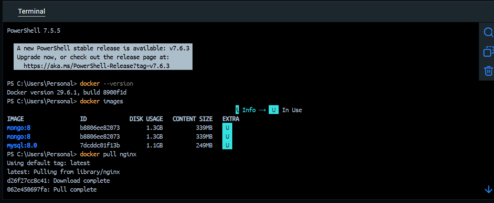
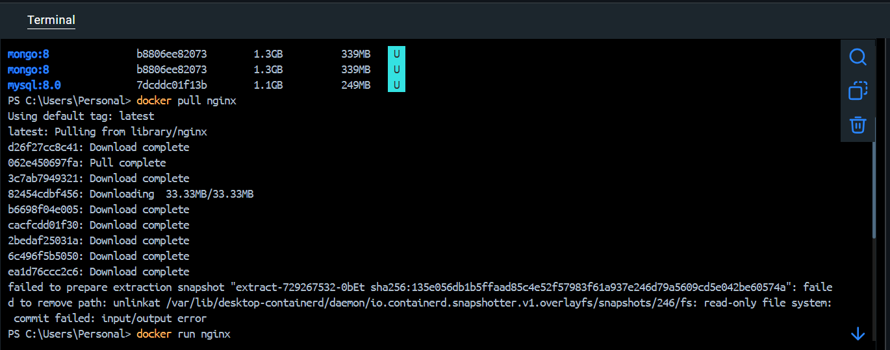
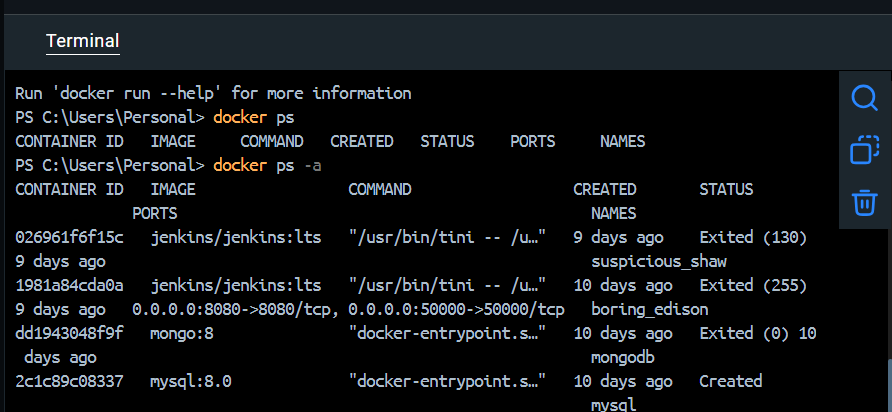
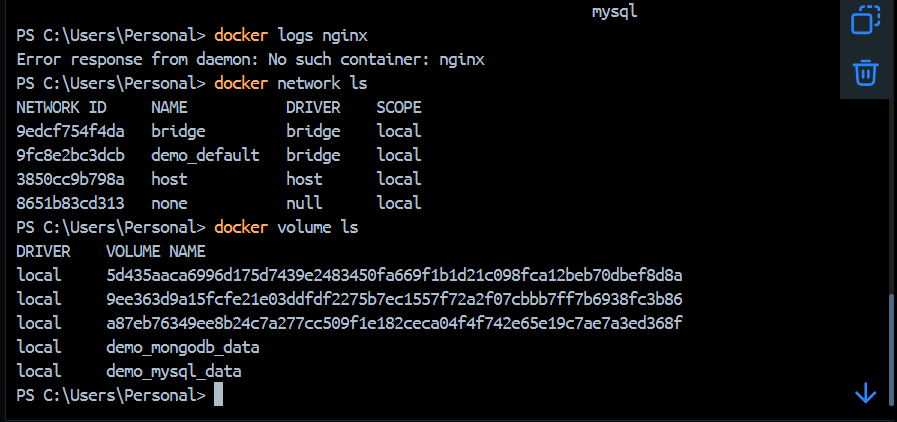

# 🐳 Docker Learning Journey

## 📖 About Docker

Docker is an open-source containerization platform that helps developers build, package, and run applications inside lightweight containers. Containers include everything required to run an application, ensuring consistency across different environments.

---

# 🎯 Learning Objectives

- Understand Docker Architecture
- Learn Docker Images and Containers
- Explore Docker Hub
- Practice Docker Commands
- Build Custom Docker Images
- Learn Dockerfile Basics
- Understand Port Mapping
- Run Nginx using Docker

---

# 📂 Topics Covered

- Docker Introduction
- Docker Architecture
- Docker Engine
- Docker Images
- Docker Containers
- Docker Hub
- Docker Installation
- Docker Commands
- Dockerfile
- Building Custom Images
- Port Mapping
- Nginx in Docker

---

# 🛠 Docker Commands

## Check Docker Version

```bash
docker --version
```

## List Images

```bash
docker images
```

## Pull an Image

```bash
docker pull nginx
```

## Run a Container

```bash
docker run -d --name mynginx -p 8080:80 nginx
```

## List Running Containers

```bash
docker ps
```

## List All Containers

```bash
docker ps -a
```

## Stop a Container

```bash
docker stop mynginx
```

## Start a Container

```bash
docker start mynginx
```

## Restart a Container

```bash
docker restart mynginx
```

## Remove a Container

```bash
docker rm mynginx
```

## Remove an Image

```bash
docker rmi nginx
```

## View Container Logs

```bash
docker logs mynginx
```

## Access Container Terminal

```bash
docker exec -it mynginx sh
```

---

# 📄 Dockerfile Example

```dockerfile
FROM nginx
COPY . /usr/share/nginx/html
```

Build Image

```bash
docker build -t mywebsite .
```

Run Image

```bash
docker run -d -p 8080:80 mywebsite
```

---

# 🌐 Port Mapping

```text
Host Machine (8080)
        │
        ▼
Docker Container (80)
```

Example:

```bash
docker run -d -p 8080:80 nginx
```

Open:

```
http://localhost:8080
```

---

# 📸 Practical Screenshots

## Docker Image Pull



---

## Running Docker Container



---

## Docker Images



---

## Docker Containers



---

# 📚 Key Concepts Learned

- Docker Basics
- Docker Engine
- Docker Images
- Docker Containers
- Docker Hub
- Dockerfile
- Custom Docker Images
- Port Mapping
- Nginx Deployment
- Basic Docker Commands

---

# 🎯 Outcome

Successfully learned Docker fundamentals through hands-on practice. Gained practical experience in downloading images, running containers, building custom images using Dockerfiles, managing containers, and exposing applications using port mapping.

---

## ⭐ Repository Purpose

This repository documents my Docker learning journey with notes, commands, practical examples, and screenshots as part of my DevOps learning roadmap.
