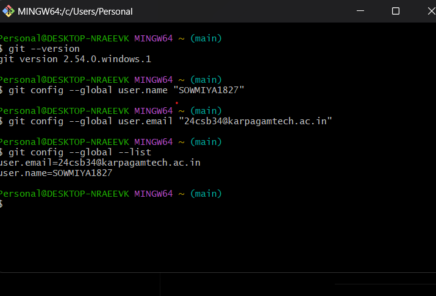
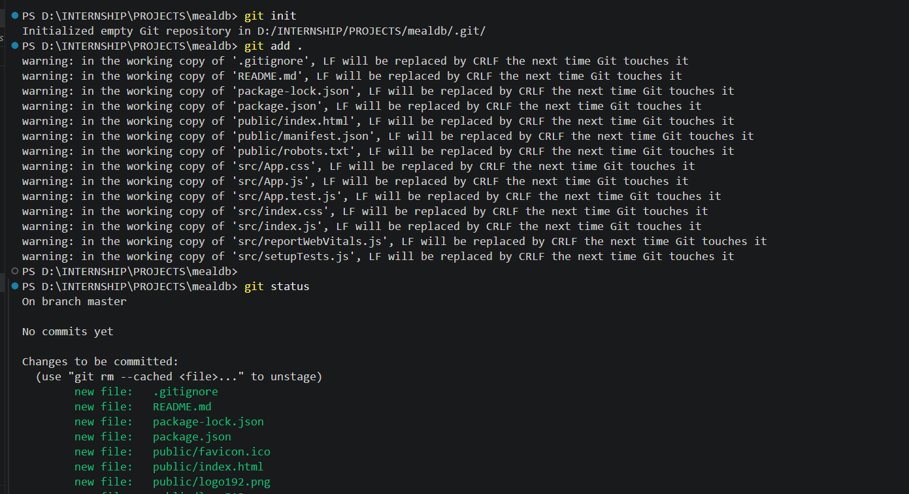
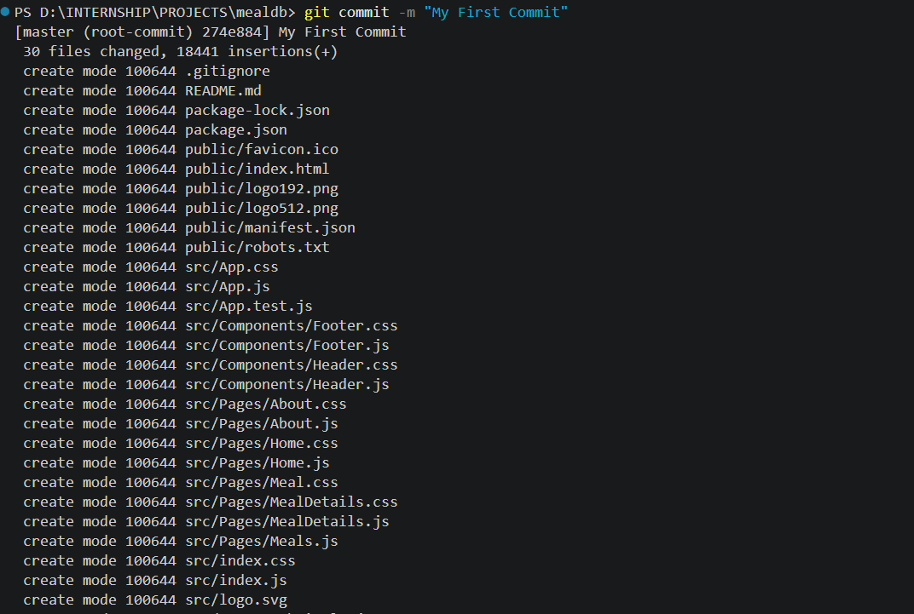
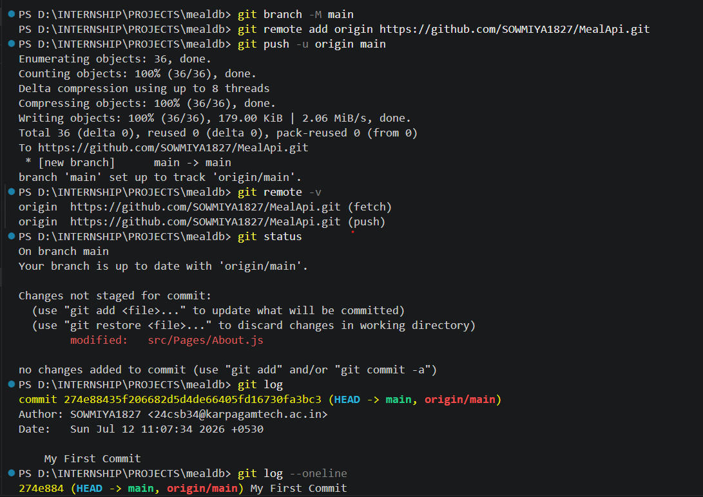
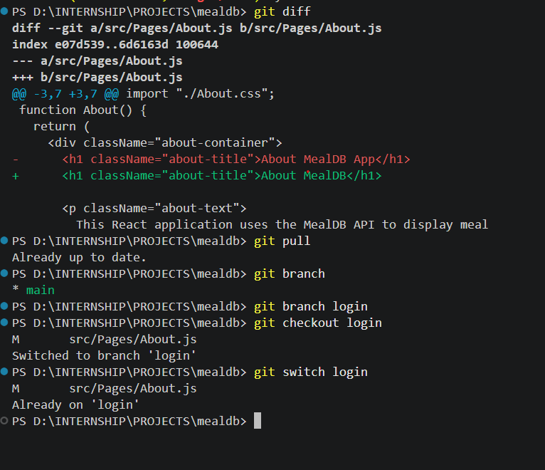

# 🌿 Git & GitHub Basics

## 📖 Introduction

Git is a Distributed Version Control System (DVCS) that helps developers track changes in source code, manage project history, and collaborate efficiently.

GitHub is a cloud-based platform used to host Git repositories online, making it easy to store, share, and collaborate on projects.

---

# 💻 Environment

- 🖥️ Operating System : Windows 11
- 💻 Editor : Visual Studio Code
- 🌿 Version Control : Git
- ☁️ Repository Hosting : GitHub

---

# 🚀 Git Commands Practiced

## 1️⃣ Check Git Version

```bash
git --version
```

---

## 2️⃣ Configure Username

```bash
git config --global user.name "Your Name"
```

---

## 3️⃣ Configure Email

```bash
git config --global user.email "yourmail@example.com"
```

---

## 4️⃣ View Git Configuration

```bash
git config --global --list
```

---

## 5️⃣ Initialize a Git Repository

```bash
git init
```

---

## 6️⃣ Check Repository Status

```bash
git status
```

---

## 7️⃣ Add Files to Staging Area

```bash
git add .
```

---

## 8️⃣ Commit Changes

```bash
git commit -m "My First Commit"
```

---

## 9️⃣ View Commit History

```bash
git log
```

---

## 🔟 View Commit History (Short)

```bash
git log --oneline
```

---

## 1️⃣1️⃣ View File Differences

```bash
git diff
```

---

## 1️⃣2️⃣ Rename Current Branch

```bash
git branch -M main
```

---

## 1️⃣3️⃣ View Available Branches

```bash
git branch
```

---

## 1️⃣4️⃣ Create a New Branch

```bash
git branch login
```

---

## 1️⃣5️⃣ Switch to Another Branch

```bash
git switch login
```

or

```bash
git checkout login
```

---

## 1️⃣6️⃣ Create and Switch to a Branch

```bash
git switch -c signup
```

---

## 1️⃣7️⃣ Merge a Branch

```bash
git switch main
git merge login
```

---

## 1️⃣8️⃣ Delete a Branch

```bash
git branch -d login
```

---

## 1️⃣9️⃣ Connect Local Repository to GitHub

```bash
git remote add origin https://github.com/USERNAME/REPOSITORY.git
```

---

## 2️⃣0️⃣ Verify Remote Repository

```bash
git remote -v
```

---

## 2️⃣1️⃣ Push Project to GitHub

```bash
git push -u origin main
```

---

## 2️⃣2️⃣ Download Latest Changes

```bash
git pull
```

---

## 2️⃣3️⃣ Download Without Merging

```bash
git fetch
```

---

## 2️⃣4️⃣ Clone an Existing Repository

```bash
git clone https://github.com/USERNAME/REPOSITORY.git
```

---

# 📚 Concepts Learned

- 🌿 Git
- ☁️ GitHub
- 📂 Repository
- 💻 Local Repository
- ☁️ Remote Repository
- 🔗 Origin
- 🌳 Branch
- 📝 Commit
- 📦 Staging Area
- 📜 Commit History
- 🔄 Checkout
- 🔀 Switch
- 🔗 Merge
- 🚀 Push
- 📥 Pull
- 📡 Fetch
- 📋 Clone

---

# 📸 Practice Screenshots

### Git & GitHub Practice











---

# ✅ Conclusion

In this practice session, I learned the fundamentals of **Git and GitHub**, including repository creation, version control, commit history, branching, switching branches, merging, connecting a remote repository, and pushing projects to GitHub.

These concepts form the foundation for collaborative software development and DevOps workflows.

🚀 Happy Learning!
